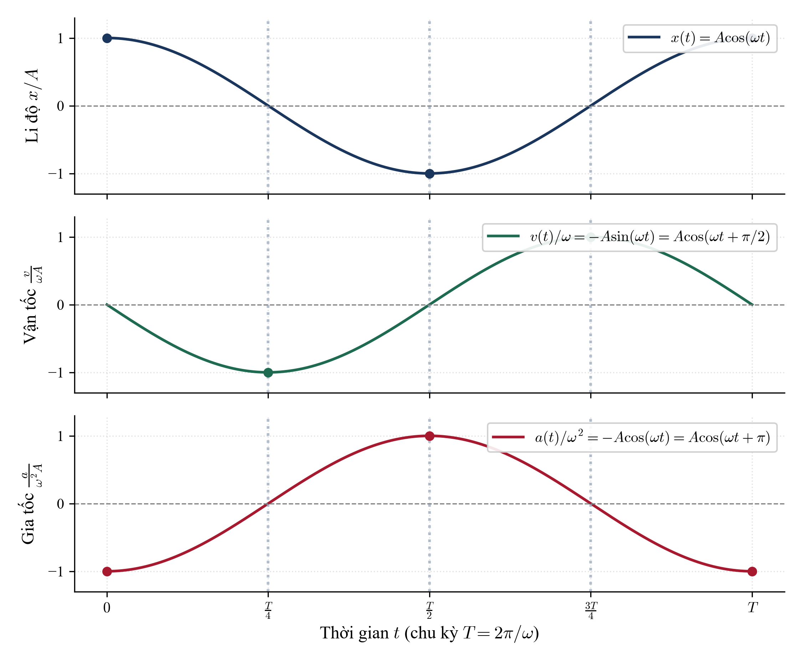
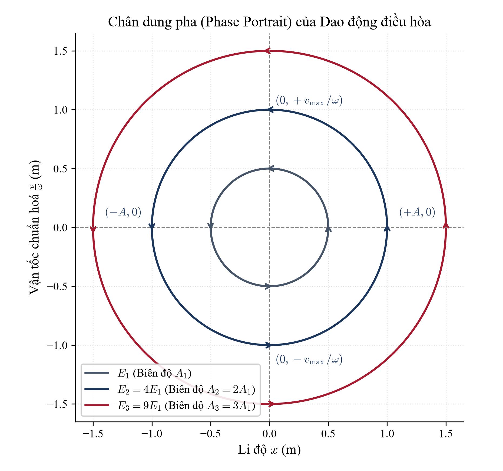
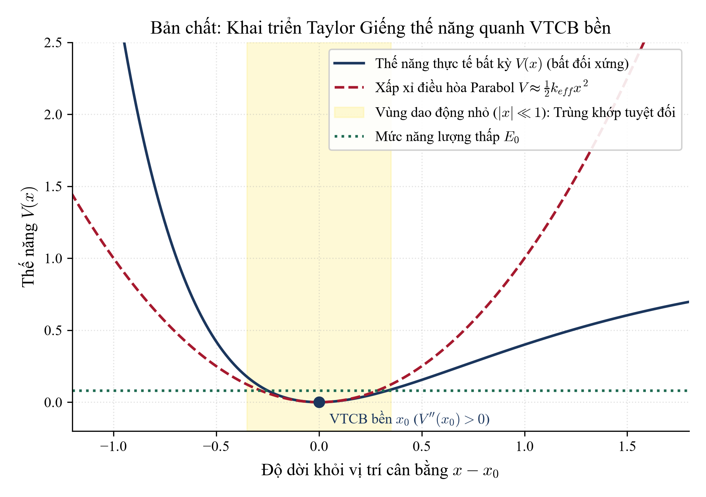
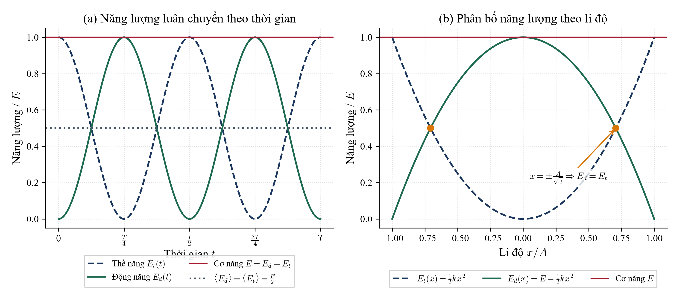
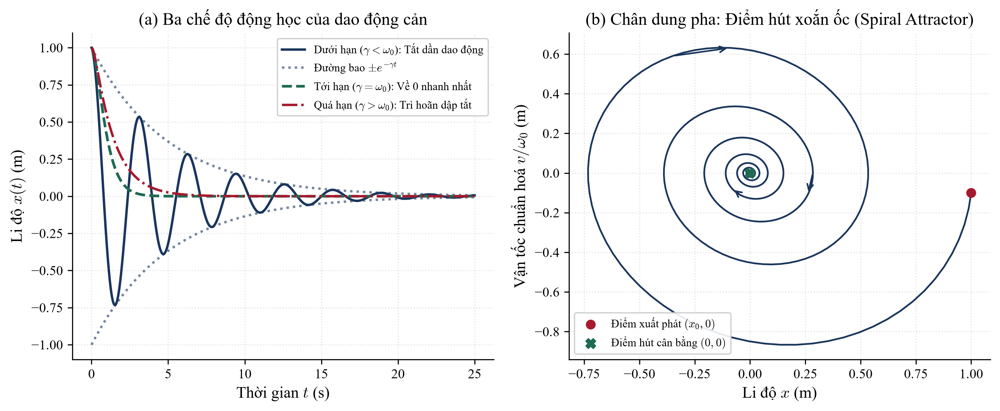
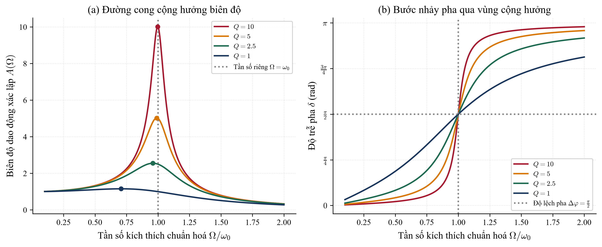

# CHƯƠNG 1: DAO ĐỘNG ĐIỀU HÒA – BẢN CHẤT ĐỘNG LỰC HỌC VÀ KHÔNG GIAN PHA

---

> ### 📌 Hộp công cụ: Toán học tối thiểu cho Chương 1
> Trước khi đi sâu vào bản chất vật lý của các dao động, người đọc cần nắm vững các công cụ giải tích toán học nền tảng sau:
> 1. **Đạo hàm hàm hợp theo thời gian:**
>    $$\frac{d}{dt}\cos(\omega t + \varphi) = -\omega \sin(\omega t + \varphi), \quad \frac{d}{dt}\sin(\omega t + \varphi) = \omega \cos(\omega t + \varphi)$$
> 2. **Khai triển chuỗi Taylor (Taylor Series):** Xấp xỉ một hàm số khả vi $f(x)$ quanh điểm lân cận $x_0$:
>    $$f(x) = f(x_0) + f'(x_0)(x - x_0) + \frac{1}{2!}f''(x_0)(x - x_0)^2 + \frac{1}{3!}f'''(x_0)(x - x_0)^3 + \dots$$
> 3. **Phương trình vi phân tuyến tính cấp hai hệ số hằng:** Dạng thuần nhất $\ddot{x} + \omega_0^2 x = 0$ có phương trình đặc trưng $r^2 + \omega_0^2 = 0 \Rightarrow r = \pm i\omega_0$, dẫn tới nghiệm thực dao động $x(t) = A\cos(\omega_0 t + \varphi)$.
> 4. **Công thức Euler về số phức:** $e^{i\theta} = \cos\theta + i\sin\theta$. Phép nhân với đơn vị ảo $i = e^{i\pi/2}$ tương đương hình học với một phép quay góc $\pi/2$ ngược chiều kim đồng hồ trên mặt phẳng phức.

---

## 1. ĐỘNG HỌC DAO ĐỘNG: TỪ PHÉP ĐẠO HÀM ĐẾN KHÔNG GIAN PHA

### 1.1. Giới hạn của cách tiếp cận trong Sách giáo khoa hiện hành

Trong các bộ sách giáo khoa Vật lí 11 hiện hành (Kết nối tri thức, Cánh Diều, Chân trời sáng tạo), phương trình dao động điều hòa:
$$x(t) = A\cos(\omega t + \varphi)$$
thường được giới thiệu như một **tiên đề thừa nhận** hoặc suy ra từ hình chiếu của một chất điểm chuyển động tròn đều lên một trục tọa độ. 

Cách tiếp cận hình học này mang lại trực giác trực quan ban đầu, nhưng lại tạo ra một ngộ nhận tai hại: *Học sinh tưởng rằng dao động điều hòa xảy ra vì vật đang "quay ngầm" trong một đường tròn tưởng tượng nào đó.*

Về mặt bản chất tự nhiên, một hệ vật lý không hề biết đến "vòng tròn tưởng tượng". Nó dao động điều hòa chỉ bởi vì **định luật động lực học chi phối nó tạo ra một gia tốc luôn tỉ lệ thuận nhưng ngược hướng với li độ**:
$$a(t) = -\omega^2 x(t)$$

### 1.2. Dẫn xuất giải tích: Vận tốc, Gia tốc và Độ lệch pha

Để mô tả chuyển động một cách chuẩn tắc, ta sử dụng phép vi phân theo thời gian $t$. Ký hiệu đạo hàm cấp một là $\dot{x} \equiv \frac{dx}{dt}$ và đạo hàm cấp hai là $\ddot{x} \equiv \frac{d^2x}{dt^2}$.

1. **Li độ (Displacement):** 
   $$x(t) = A\cos(\omega t + \varphi)$$
   trong đó $A > 0$ là biên độ dao động, $\omega > 0$ là tần số góc, và $\varphi$ là pha ban đầu tại $t = 0$.

2. **Vận tốc (Velocity):** Tốc độ biến thiên tức thời của vị trí theo thời gian:
   $$v(t) = \dot{x}(t) = \frac{d}{dt}[A\cos(\omega t + \varphi)] = -\omega A \sin(\omega t + \varphi)$$
   Dùng tính chất lượng giác $\cos(\alpha + \pi/2) = -\sin\alpha$, ta viết lại:
   $$v(t) = \omega A \cos\left(\omega t + \varphi + \frac{\pi}{2}\right)$$
   *Ý nghĩa vật lý:* Vận tốc đạt giá trị cực đại $v_{\max} = \omega A$ khi vật đi qua vị trí cân bằng ($x = 0$) và **sớm pha hơn li độ một góc $\pi/2$**.

3. **Gia tốc (Acceleration):** Tốc độ biến thiên tức thời của vận tốc theo thời gian:
   $$a(t) = \dot{v}(t) = \ddot{x}(t) = \frac{d}{dt}[-\omega A \sin(\omega t + \varphi)] = -\omega^2 A \cos(\omega t + \varphi)$$
   Dùng tính chất lượng giác $\cos(\alpha + \pi) = -\cos\alpha$, ta viết lại:
   $$a(t) = \omega^2 A \cos(\omega t + \varphi + \pi)$$
   *Ý nghĩa vật lý:* Gia tốc đạt độ lớn cực đại $a_{\max} = \omega^2 A$ tại hai biên ($x = \pm A$), luôn hướng về vị trí cân bằng và **ngược pha hoàn toàn ($\pi$) so với li độ**.

*Phân tích Hình 1.1:* Đồ thị trên biểu diễn diễn tiến ba đại lượng chuẩn hóa theo một chu kỳ $T = 2\pi/\omega$. Quan sát các đường gióng dọc đứt nét:
- Tại $t = T/4$: Li độ bằng $0$ (vật qua VTCB theo chiều âm), vận tốc đạt cực tiểu đại số $v = -\omega A$, và gia tốc bằng $0$.
- Tại $t = T/2$: Li độ đạt cực tiểu $x = -A$, vận tốc bằng $0$ (vật đổi chiều chuyển động), gia tốc đạt cực đại dương $a = +\omega^2 A$ kéo vật trở lại VTCB.

### 1.3. Khái niệm Trạng thái Vật lý và Không gian Pha (Phase Space)

Trong cơ học cổ điển, nếu ta chỉ biết vị trí $x$ của một chất điểm tại thời điểm $t$, ta **không thể** dự đoán được tương lai của chất điểm đó. Để xác định hoàn toàn trạng thái động lực học tức thời của một hệ cơ học có 1 bậc tự do, ta cần một cặp biến độc lập: **(Vị trí $x$, Vận tốc $v$)** (hoặc xung lượng $p = mv$).

Không gian hai chiều với hai trục tọa độ $(x, v)$ được gọi là **Không gian Pha (Phase Space)**.

Từ hai phương trình động học:
$$\frac{x}{A} = \cos(\omega t + \varphi), \quad \frac{v}{\omega A} = -\sin(\omega t + \varphi)$$
Bình phương hai vế và cộng lại, ta triệt tiêu hoàn toàn biến thời gian $t$:
$$\left(\frac{x}{A}\right)^2 + \left(\frac{v}{\omega A}\right)^2 = \cos^2(\omega t + \varphi) + \sin^2(\omega t + \varphi) = 1$$

Đây chính là phương trình chính tắc của một đường **Ellipse** trên mặt phẳng $(x, v)$, hoặc một đường **Tròn** nếu ta chuẩn hóa trục tung thành biến vận tốc rút gọn $y = v/\omega$:
$$x^2 + \left(\frac{v}{\omega}\right)^2 = A^2$$

*Phân tích Hình 1.2:*
1. **Quỹ đạo khép kín (Closed Orbit):** Mỗi đường tròn đồng tâm ứng với một mức năng lượng xác định. Quỹ đạo khép kín phản ánh tính chất tuần hoàn: hệ lặp lại trạng thái sau mỗi chu kỳ $T$.
2. **Chiều tiến hóa duy nhất:** Vì ở nửa mặt phẳng trên ($v > 0$), li độ $x$ bắt buộc phải tăng ($\dot{x} > 0$), còn ở nửa mặt phẳng dưới ($v < 0$), li độ $x$ bắt buộc phải giảm ($\dot{x} < 0$), nên trạng thái hệ luôn chuyển động theo **chiều kim đồng hồ**.
3. **Tính không cắt nhau của các đường pha:** Hai quỹ đạo pha ứng với hai mức năng lượng khác nhau không bao giờ cắt nhau. Nếu chúng cắt nhau tại một điểm, điều đó có nghĩa là từ cùng một trạng thái ban đầu $(x_0, v_0)$ có thể phân nhánh thành hai tương lai khác nhau – điều vi phạm tính tất định của cơ học Newton!

> 🖊 **Tự kiểm tra 1.1:** *Tại sao diện tích hình elip trong không gian pha $(x, p)$ với $p = mv$ lại tỉ lệ thuận với cơ năng $E$ của hệ? Hãy thử tính tích phân diện tích $\oint p \, dx$ của một chu kỳ.*

---

## 2. ĐỘNG LỰC HỌC: BẢN CHẤT GIẾNG THẾ NĂNG VÀ KHAI TRIỂN TAYLOR

### 2.1. Phương trình vi phân Newton của con lắc lò xo

Xét một vật có khối lượng $m$ gắn vào lò xo có độ cứng $k$, chuyển động trên mặt phẳng ngang không ma sát. Theo định luật Hooke, lực hồi phục đàn hồi là:
$$F = -kx$$
Áp dụng Định luật II Newton: $\sum F = m a = m \ddot{x}$. Ta có:
$$m \ddot{x} = -kx \iff m \ddot{x} + kx = 0 \iff \ddot{x} + \frac{k}{m}x = 0$$

Đặt $\omega_0^2 = \frac{k}{m}$ (với $\omega_0 > 0$), ta thu được **phương trình vi phân dao động điều hòa tự do**:
$$\ddot{x} + \omega_0^2 x = 0$$

**Giải tích tìm nghiệm:**
Giả sử nghiệm có dạng hàm mũ $x(t) = C e^{rt}$. Thay vào phương trình vi phân:
$$C r^2 e^{rt} + \omega_0^2 C e^{rt} = 0 \iff (r^2 + \omega_0^2) C e^{rt} = 0$$
Vì nghiệm không tầm thường đòi hỏi $C \neq 0$ và $e^{rt} \neq 0$, ta có phương trình đặc trưng:
$$r^2 + \omega_0^2 = 0 \Rightarrow r = \pm i\omega_0$$
Nghiệm tổng quát là tổ hợp tuyến tính của hai nghiệm cơ sở:
$$x(t) = C_1 e^{i\omega_0 t} + C_2 e^{-i\omega_0 t}$$
Để $x(t)$ là một đại lượng vật lý thực, hai hằng số phải liên hợp phức $C_2 = C_1^*$. Đặt $C_1 = \frac{A}{2}e^{i\varphi}$, áp dụng công thức Euler:
$$x(t) = \frac{A}{2}e^{i(\omega_0 t + \varphi)} + \frac{A}{2}e^{-i(\omega_0 t + \varphi)} = A \cos(\omega_0 t + \varphi)$$
Toán học đã chứng minh độc lập: *Nghiệm của định luật Newton cho lực đàn hồi chỉ có thể là hàm điều hòa.*

### 2.2. Câu hỏi tối hậu: Vì sao Dao động Điều hòa lại phổ quát trong Tự nhiên?

Trong vũ trụ, các liên kết nguyên tử trong phân tử, dao động của màng trống, dao động của cầu treo, chuyển động của nguyên tử trong mạng tinh thể... đều không có chiếc lò xo cơ học nào bên trong. Vậy tại sao gần như mọi hệ cơ học khi bị kích động nhẹ đều dao động điều hòa?

Câu trả lời nằm ở **Hình học của Giếng Thế Năng (Potential Well)** và **Khai triển Taylor**.

Xét một chất điểm chuyển động trong một trường thế một chiều bất kỳ có thế năng $V(x)$. Lực tác dụng lên chất điểm liên hệ với thế năng qua gradient:
$$F(x) = -\frac{dV}{dx}$$

Một vị trí $x_0$ được gọi là **Vị trí Cân bằng (VTCB)** khi tổng lực tác dụng bằng $0$:
$$F(x_0) = 0 \iff V'(x_0) = \left.\frac{dV}{dx}\right|_{x = x_0} = 0$$

Ta khai triển hàm thế năng $V(x)$ thành chuỗi Taylor xung quanh vị trí cân bằng $x_0$:
$$V(x) = V(x_0) + V'(x_0)(x - x_0) + \frac{1}{2!}V''(x_0)(x - x_0)^2 + \frac{1}{3!}V'''(x_0)(x - x_0)^3 + \mathcal{O}((x - x_0)^4)$$

Phân tích từng số hạng:
1. Số hạng $V(x_0)$: Là một hằng số, đóng vai trò chọn mốc thế năng. Ta luôn có thể chọn mốc thế năng tại $x_0$ sao cho $V(x_0) = 0$.
2. Số hạng $V'(x_0)(x - x_0)$: Bằng $0$ vì $x_0$ là vị trí cân bằng ($V'(x_0) = 0$).
3. **Số hạng bậc hai:** Nếu $x_0$ là một **vị trí cân bằng bền**, thì thế năng tại đó phải đạt cực tiểu địa phương, nghĩa là đạo hàm cấp hai phải dương:
   $$k_{eff} \equiv V''(x_0) = \left.\frac{d^2V}{dx^2}\right|_{x = x_0} > 0$$
4. Các số hạng bậc cao $\mathcal{O}((x - x_0)^3)$: Khi dao động có biên độ nhỏ, tức độ dời $\Delta x = |x - x_0| \ll 1$, các lũy thừa $(\Delta x)^3, (\Delta x)^4$ trở nên cực kỳ bé và hoàn toàn có thể bỏ qua.

Do đó, với mọi dao động nhỏ, thế năng thực tế luôn được xấp xỉ hoàn hảo bởi một **hàm Parabol**:
$$V(x) \approx \frac{1}{2} k_{eff} (x - x_0)^2$$

Lực hồi phục tương ứng là:
$$F(x) = -\frac{dV}{dx} \approx -k_{eff}(x - x_0)$$

*Kết luận mang tính nguyên lý:*
> **Bản chất vật lý cốt lõi:** Đáy của bất kỳ giếng thế năng trơn nào đều có dạng một đường cong parabol. Do đó, **mọi dao động nhỏ xung quanh một vị trí cân bằng bền bất kỳ trong tự nhiên đều là dao động điều hoà**, với độ cứng hiệu dụng $k_{eff} = V''(x_0)$ và tần số góc riêng:
> $$\omega_0 = \sqrt{\frac{V''(x_0)}{m}}$$

### 2.3. Con lắc Đơn: Ví dụ về Giới hạn Tuyến tính và Tính Phi tuyến

Xét một con lắc đơn gồm dây nhẹ không dãn chiều dài $\ell$, vật nặng khối lượng $m$.
Phương trình động lực học chính xác theo phương tiếp tuyến là:
$$F_t = -mg\sin\theta = m a_t = m \ell \ddot{\theta} \iff \ddot{\theta} + \frac{g}{\ell}\sin\theta = 0$$

Khai triển Taylor của hàm $\sin\theta$:
$$\sin\theta = \theta - \frac{\theta^3}{6} + \frac{\theta^5}{120} - \dots$$

* **Khi góc lệch bé ($\theta \ll 1\text{ rad}$, xấp xỉ $\theta < 10^\circ$):**
  Ta chỉ giữ lại số hạng bậc nhất $\sin\theta \approx \theta$. Phương trình trở thành tuyến tính:
  $$\ddot{\theta} + \omega_0^2 \theta = 0 \quad \text{với } \omega_0 = \sqrt{\frac{g}{\ell}}$$
  Hệ dao động điều hòa với chu kỳ độc lập với biên độ (tính đẳng thời).

* **Khi góc lệch lớn:** 
  Số hạng phi tuyến $-\frac{\theta^3}{6}$ bắt đầu phát huy tác dụng. Lực kéo về thực tế nhỏ hơn lực tuyến tính $\theta$, khiến con lắc chuyển động chậm hơn khi ra xa VTCB. Chu kỳ thực tế sẽ tăng theo biên độ góc $\theta_0$ theo công thức Borda:
  $$T \approx 2\pi\sqrt{\frac{\ell}{g}} \left(1 + \frac{\theta_0^2}{16}\right)$$

> 🖊 **Tự kiểm tra 1.2:** *Nếu đặt một chất điểm ở đỉnh một ngọn đồi có thế năng $V(x) = -c x^2$ ($c > 0$), phương trình chuyển động của chất điểm sẽ như thế nào? Nghiệm của nó có dao động không?*

---

## 3. NĂNG LƯỢNG: ĐỊNH LUẬT BẢO TOÀN VÀ ĐỊNH LÝ VIRIAL

### 3.1. Dẫn xuất Định luật Bảo toàn Cơ năng bằng Giải tích

Cơ năng toàn phần của một dao động điều hòa là tổng của động năng và thế năng đàn hồi:
$$E = E_d + E_t = \frac{1}{2}mv^2 + \frac{1}{2}kx^2$$

Ta chứng minh tính bảo toàn bằng cách lấy đạo hàm của cơ năng $E$ theo biến thời gian $t$:
$$\frac{dE}{dt} = \frac{d}{dt}\left(\frac{1}{2}mv^2 + \frac{1}{2}kx^2\right) = m v \frac{dv}{dt} + k x \frac{dx}{dt}$$
Vì $\frac{dv}{dt} = a = \ddot{x}$ và $\frac{dx}{dt} = v$, ta nhóm nhân tử chung $v$:
$$\frac{dE}{dt} = v (m \ddot{x} + kx)$$
Nhưng từ phương trình vi phân chuyển động, $m \ddot{x} + kx \equiv 0$ tại mọi thời điểm! Do đó:
$$\frac{dE}{dt} = 0 \iff E(t) = \text{const}$$
Cơ năng được bảo toàn tuyệt đối theo thời gian.

Thay nghiệm $x(t) = A\cos(\omega t + \varphi)$ và $v(t) = -\omega A\sin(\omega t + \varphi)$ với $\omega^2 = k/m$:
$$E_t(t) = \frac{1}{2}kA^2 \cos^2(\omega t + \varphi)$$
$$E_d(t) = \frac{1}{2}m (\omega A)^2 \sin^2(\omega t + \varphi) = \frac{1}{2}kA^2 \sin^2(\omega t + \varphi)$$
Cộng lại:
$$E = E_t(t) + E_d(t) = \frac{1}{2}kA^2 [\cos^2(\omega t + \varphi) + \sin^2(\omega t + \varphi)] = \frac{1}{2}kA^2$$

### 3.2. Chu kỳ Biến thiên và Giá trị Trung bình (Định lý Virial)

1. **Chu kỳ biến thiên của năng lượng:**
   Sử dụng công thức hạ bậc:
   $$\cos^2(\omega t) = \frac{1 + \cos(2\omega t)}{2}, \quad \sin^2(\omega t) = \frac{1 - \cos(2\omega t)}{2}$$
   Cả động năng và thế năng đều dao động tuần hoàn với **tần số góc gấp đôi $2\omega$**, tức chu kỳ biến thiên năng lượng chỉ bằng một nửa chu kỳ dao động:
   $$T_E = \frac{T}{2}$$

2. **Giá trị trung bình thời gian và Định lý Virial:**
   Tính tích phân trung bình của động năng trong một chu kỳ dao động $T$:
   $$\langle E_d \rangle = \frac{1}{T}\int_0^T E_d(t) dt = \frac{1}{T} \int_0^T \frac{1}{2}kA^2 \sin^2(\omega t + \varphi) dt$$
   Vì giá trị trung bình của hàm $\sin^2$ trong một chu kỳ luôn bằng $1/2$:
   $$\langle E_d \rangle = \frac{1}{2} \left(\frac{1}{2}kA^2\right) = \frac{E}{2}$$
   Tương tự đối với thế năng:
   $$\langle E_t \rangle = \frac{1}{2} \left(\frac{1}{2}kA^2\right) = \frac{E}{2}$$
   Do đó:
   $$\langle E_d \rangle = \langle E_t \rangle = \frac{1}{2}E$$
   Đây là một trường hợp riêng của **Định lý Virial** trong cơ học lý thuyết: Đối với mọi thế năng bậc hai $V(x) \propto x^2$, giá trị trung bình của động năng luôn luôn bằng giá trị trung bình của thế năng.

---

## 4. DAO ĐỘNG TẮT DẦN: CƠ CHẾ TIÊU TÁN NĂNG LƯỢNG VI MÔ

### 4.1. Cơ chế Vi mô của Lực Cản Nhớt

Trong thế giới vĩ mô thực tế, không có dao động nào duy trì mãi mãi nếu không được cấp năng lượng. Khi một vật dao động trong môi trường (không khí, dầu nhớt), nó liên tục va chạm với hàng tỷ phân tử môi trường xung quanh. 

Mỗi va chạm truyền một phần động năng có trật tự của con lắc thành động năng nhiệt chuyển động hỗn loạn của các phân tử chất lưu. Quá trình này không thể đảo ngược (theo Định luật II Nhiệt động lực học), dẫn tới sự tiêu tán năng lượng từ hệ dao động ra môi trường nhiệt xung quanh.

Ở tốc độ chuyển động nhỏ, lực cản nhớt tỉ lệ thuận với vận tốc và ngược chiều chuyển động:
$$\vec{F}_c = -b \vec{v} \quad (b > 0 \text{ là hệ số cản})$$

### 4.2. Phương trình Vi phân có Cản và Ba Chế độ Động học

Áp dụng Định luật II Newton:
$$m \ddot{x} = -kx - b \dot{x} \iff m \ddot{x} + b \dot{x} + kx = 0$$
Chia hai vế cho $m$, ta đưa về dạng chuẩn tắc:
$$\ddot{x} + 2\gamma \dot{x} + \omega_0^2 x = 0$$
trong đó $\omega_0 = \sqrt{k/m}$ là tần số góc tự nhiên, và $\gamma = \frac{b}{2m}$ là **hệ số tắt dần**.

Phương trình đặc trưng tương ứng:
$$r^2 + 2\gamma r + \omega_0^2 = 0 \Rightarrow r_{1,2} = -\gamma \pm \sqrt{\gamma^2 - \omega_0^2}$$

Tùy thuộc vào mối tương quan giữa độ lớn lực cản $\gamma$ và lực hồi phục $\omega_0$, tự nhiên phân nhánh thành **3 chế độ vật lý**:

1. **Chế độ Tắt dần dưới hạn (Underdamped: $\gamma < \omega_0$):**
   Biểu thức dưới căn âm: $\sqrt{\gamma^2 - \omega_0^2} = i \omega_d$ với $\omega_d = \sqrt{\omega_0^2 - \gamma^2}$ là tần số góc dao động tắt dần.
   Nghiệm của phương trình:
   $$x(t) = A_0 e^{-\gamma t} \cos(\omega_d t + \varphi)$$
   - Biên độ suy giảm theo hàm mũ $A(t) = A_0 e^{-\gamma t}$.
   - Tần số dao động $\omega_d$ luôn nhỏ hơn tần số tự nhiên $\omega_0$.
   - Giảm lượng loga (Logarithmic decrement): $\delta = \ln\frac{x(t)}{x(t + T_d)} = \gamma T_d$.

2. **Chế độ Tới hạn (Critically Damped: $\gamma = \omega_0$):**
   Phương trình đặc trưng có nghiệm kép $r_1 = r_2 = -\gamma$.
   Nghiệm tổng quát:
   $$x(t) = (C_1 + C_2 t) e^{-\gamma t}$$
   Hệ không còn dao động nữa mà trở về vị trí cân bằng trong **thời gian ngắn nhất mà không bị vọt lố (overshoot)**. Đây là chế độ lý tưởng được ứng dụng để thiết kế bộ giảm xóc xe hơi, cửa đóng tự động, hoặc kim hiển thị của đồng hồ đo điện cơ khí.

3. **Chế độ Quá hạn (Overdamped: $\gamma > \omega_0$):**
   Hai nghiệm thực phân biệt $r_1, r_2 < 0$. Nghiệm là tổng của hai hàm suy giảm mũ:
   $$x(t) = C_1 e^{r_1 t} + C_2 e^{r_2 t}$$
   Lực cản quá lớn khiến hệ chuyển động ì ạch, mất rất nhiều thời gian mới bò dần về vị trí cân bằng.

*Phân tích Chân dung pha (Hình 1.5b):* Khi có lực cản, quỹ đạo trong không gian pha không còn là đường cong khép kín nữa. Thay vào đó, nó xoắn ốc liên tục hướng vào gốc tọa độ $(0, 0)$. Điểm gốc $(0,0)$ đóng vai trò là một **Điểm hút (Attractor)**. Diện tích giới hạn bởi quỹ đạo pha co lại theo thời gian, phản ánh sự mất mát cơ năng liên tục của hệ.

---

## 5. DAO ĐỘNG CƯỠNG BỨC: BẢN CHẤT CỘNG HƯỞNG VÀ HỆ SỐ PHẨM CHẤT Q

### 5.1. Thiết lập Phương trình Vi phân Cưỡng bức

Để bù đắp năng lượng tiêu tán do ma sát, ta tác dụng vào hệ một ngoại lực biến thiên tuần hoàn:
$$F_{ext}(t) = F_0 \cos(\Omega t)$$
trong đó $F_0$ là biên độ lực kích thích và $\Omega$ là tần số góc kích thích.

Phương trình vi phân tổng quát chi phối dao động:
$$\ddot{x} + 2\gamma \dot{x} + \omega_0^2 x = \frac{F_0}{m}\cos(\Omega t)$$

Nghiệm tổng quát gồm hai phần: $x(t) = x_{trans}(t) + x_{ss}(t)$.
- Nghiệm chuyển tiếp $x_{trans}(t) \propto e^{-\gamma t}$: Bị dập tắt sau một khoảng thời gian ngắn.
- Nghiệm xác lập (Steady-state solution) $x_{ss}(t)$: Tồn tại lâu dài với tần số góc bằng đúng tần số $\Omega$ của ngoại lực:
  $$x_{ss}(t) = A(\Omega) \cos(\Omega t - \delta)$$

Sử dụng phương pháp số phức hoặc vectơ quay Fresnel, ta tìm được biên độ $A(\Omega)$ và góc trễ pha $\delta(\Omega)$:
$$A(\Omega) = \frac{F_0/m}{\sqrt{(\omega_0^2 - \Omega^2)^2 + 4\gamma^2\Omega^2}}$$
$$\tan\delta = \frac{2\gamma\Omega}{\omega_0^2 - \Omega^2}$$

### 5.2. Giải mã Bản chất Vật lý Tối thượng của Hiện tượng Cộng hưởng

Tại sao khi tần số ngoại lực $\Omega$ xấp xỉ tần số riêng $\omega_0$ thì biên độ dao động lại vọt lên một giá trị khổng lồ?

Hầu hết học sinh chỉ nhìn vào mẫu số toán học triệt tiêu khi $\Omega \to \omega_0$. Nhưng **bản chất vật lý nằm ở tốc độ truyền công suất từ ngoại lực vào hệ dao động**.

Công suất tức thời mà ngoại lực sinh ra trên vật là:
$$P(t) = \vec{F}_{ext}(t) \cdot \vec{v}(t) = [F_0 \cos(\Omega t)] \cdot [-\Omega A \sin(\Omega t - \delta)]$$
Biến đổi lượng giác:
$$P(t) = F_0 \Omega A \cos(\Omega t) \sin(\delta - \Omega t) = F_0 \Omega A [\sin\delta \cos^2(\Omega t) - \cos\delta \sin(\Omega t)\cos(\Omega t)]$$

Lấy giá trị trung bình của công suất qua một chu kỳ $T = 2\pi/\Omega$:
$$\langle \cos^2(\Omega t) \rangle = \frac{1}{2}, \quad \langle \sin(\Omega t)\cos(\Omega t) \rangle = 0$$
Ta thu được công suất trung bình được bơm vào hệ:
$$\langle P \rangle = \frac{1}{2} F_0 \Omega A(\Omega) \sin\delta$$

Quan sát biểu thức: Công suất bơm vào hệ tỉ lệ thuận với $\sin\delta$!
1. **Khi kích thích rất chậm ($\Omega \ll \omega_0$):** $\delta \approx 0 \Rightarrow \sin\delta \approx 0 \Rightarrow \langle P \rangle \approx 0$. Ngoại lực và li độ cùng pha, nhưng ngoại lực vuông pha với vận tốc. Ngoại lực kéo vật trong nửa chu kỳ rồi lại bị vật kéo lại trong nửa chu kỳ sau, công suất ròng đưa vào hệ xấp xỉ bằng $0$.
2. **Khi xảy ra cộng hưởng ($\Omega \approx \omega_0$):**
   Từ công thức trễ pha, khi $\Omega = \omega_0$, mẫu số bằng $0 \Rightarrow \tan\delta \to +\infty \Rightarrow \delta = \frac{\pi}{2}$.
   Khi đó:
   $$\sin\delta = \sin(\pi/2) = 1 \quad (\text{CỰC ĐẠI TUYỆT ĐỐI!})$$
   Đồng thời:
   $$v(t) = \Omega A \cos(\Omega t - \delta + \pi/2) = \Omega A \cos(\Omega t)$$
   *Ý nghĩa sâu sắc nhất:* Khi $\Omega = \omega_0$, ngoại lực vuông pha với li độ nhưng **hoàn toàn đồng pha với vận tốc** tại mọi thời điểm ($\vec{F}_{ext}$ luôn cùng hướng với $\vec{v}$). 
   
   Bất cứ khi nào con lắc chuyển động sang phải, lực đẩy sang phải; khi con lắc chuyển động sang trái, lực đẩy sang trái. Ngoại lực **không bao giờ hãm vật lại**, tốc độ bơm năng lượng đạt giá trị cực đại dương $\langle P \rangle_{\max}$, khiến biên độ tích lũy đạt tới đỉnh cực đại!

### 5.3. Hệ số Phẩm chất Q (Quality Factor)

Hệ số phẩm chất $Q$ đặc trưng cho khả năng tích trữ năng lượng của một hệ dao động so với năng lượng tiêu tán mỗi chu kỳ:
$$Q \equiv 2\pi \frac{\text{Năng lượng tích trữ}}{\text{Năng lượng tiêu hao trong 1 chu kỳ}} = \frac{\omega_0}{2\gamma}$$

- Hệ có $Q$ cao (lực cản rất bé): Đỉnh cộng hưởng rất cao và nhọn (Hình 1.6a). Hệ phản ứng cực kỳ nhạy với đúng tần số riêng $\omega_0$ và bỏ qua các tần số khác. Đây là nguyên lý chọn đài của mạch thu sóng radio (mạch cộng hưởng LC) hoặc chén thủy tinh vỡ khi gặp giọng hát đúng tần số.
- Hệ có $Q$ thấp (lực cản lớn): Đỉnh cộng hưởng thấp, tù và dịch chuyển nhẹ về phía tần số thấp $\Omega_R = \sqrt{\omega_0^2 - 2\gamma^2}$.

---

## 6. BÀI TẬP VÀ THÍ NGHIỆM TƯ DUY PHẢN BIỆN

### Thí nghiệm tư duy 1.1: Đường hầm xuyên tâm Trái Đất
> Giả sử Trái Đất là một khối cầu đồng chất bán kính $R$ và khối lượng $M$. Người ta đào một đường hầm thẳng tắp xuyên qua tâm Trái Đất từ cực này sang cực kia. Thả một hòn sỏi khối lượng $m$ không vận tốc đầu vào miệng hầm (bỏ qua ma sát không khí).
> 
> 1. Dùng Định luật Gauss cho trọng trường để chứng minh lực tác dụng lên hòn sỏi khi nó ở cách tâm Trái Đất khoảng $r$ tỉ lệ thuận với $r$: $F(r) = -\left(\frac{G M m}{R^3}\right) r$.
> 2. Suy ra chuyển động của hòn sỏi là một dao động điều hòa xuyên tâm Trái Đất. Tính chu kỳ dao động $T$ và so sánh với chu kỳ quay của một vệ tinh bay sát mặt đất.

### Thí nghiệm tư duy 1.2: Ma sát âm và Chu trình Giới hạn (Limit Cycle)
> Một hệ dao động có phương trình vi phân dạng Van der Pol:
> $$\ddot{x} - \alpha (1 - x^2)\dot{x} + \omega_0^2 x = 0 \quad (\alpha > 0)$$
> 1. Hãy phân tích dấu của hệ số cản hiệu dụng $\gamma_{eff} = -\alpha(1 - x^2)$: Khi biên độ nhỏ ($|x| < 1$), hệ số cản mang dấu gì? Điều này bơm năng lượng hay tiêu tán năng lượng của hệ?
> 2. Khi biên độ lớn ($|x| > 1$), điều gì sẽ xảy ra? Từ đó giải thích vì sao hệ tự động hội tụ về một biên độ dao động ổn định (Chu trình giới hạn - Limit Cycle) mà không cần ngoại lực tuần hoàn bên ngoài. Đây chính là bản chất của các bộ dao động đồng hồ và nhịp đập của quả tim người!

---

## TỔNG KẾT BẢN CHẤT CHƯƠNG 1

| Hiện tượng | Tiếp cận hình thức SGK | Bản chất Vật lý & Toán học Giải tích |
| :--- | :--- | :--- |
| **Dao động điều hòa** | Thừa nhận $x = A\cos(\omega t + \varphi)$ | Nghiệm của phương trình vi phân $a = -\omega^2 x$. Mọi dao động nhỏ quanh cực tiểu giếng thế năng $V''(x_0) > 0$ đều là dao động điều hòa qua khai triển Taylor. |
| **Không gian trạng thái** | Chỉ khảo sát đồ thị $x-t$ | Không gian pha $(x, v/\omega)$ với quỹ đạo elip khép kín, bảo toàn diện tích pha và tính tất định cơ học. |
| **Bảo toàn năng lượng** | Ráp số $E = \frac{1}{2}mv^2 + \frac{1}{2}kx^2$ | Đạo hàm thời gian triệt tiêu $\frac{dE}{dt} = 0$. Cân bằng năng lượng Virial $\langle E_d \rangle = \langle E_t \rangle = \frac{1}{2}E$. |
| **Tắt dần** | "Ma sát làm giảm biên độ" | Cơ chế vi mô tán xạ động năng thành nhiệt. Chân dung pha biến thành điểm hút xoắn ốc (Attractor). Ba chế độ: Dưới hạn, tới hạn, quá hạn. |
| **Cộng hưởng** | "Biên độ cực đại khi $f = f_0$" | Ngoại lực đồng pha hoàn toàn với vận tốc ($\delta = \pi/2$), tốc độ bơm công suất $\langle P \rangle = \frac{1}{2}F_0 \Omega A \sin\delta$ đạt cực đại tuyệt đối. |
