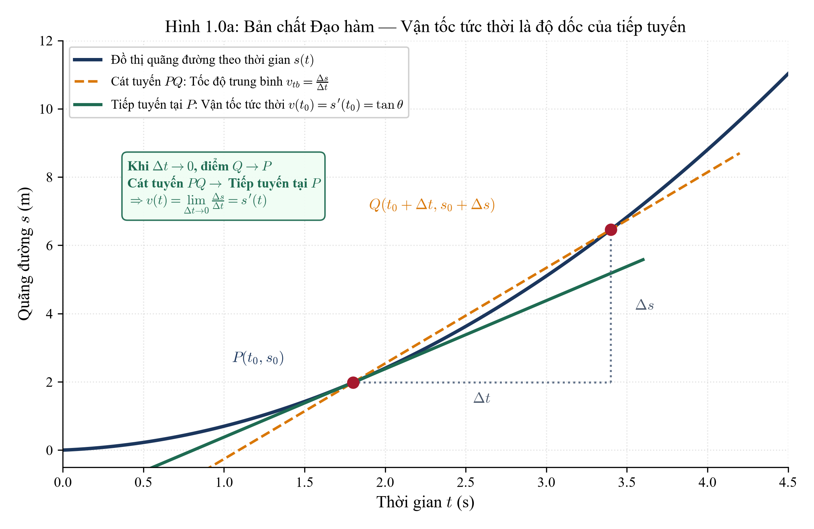
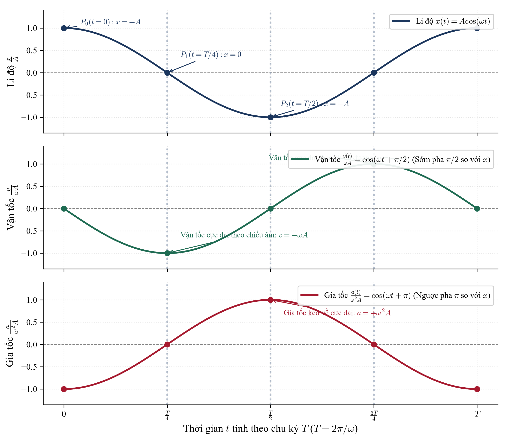
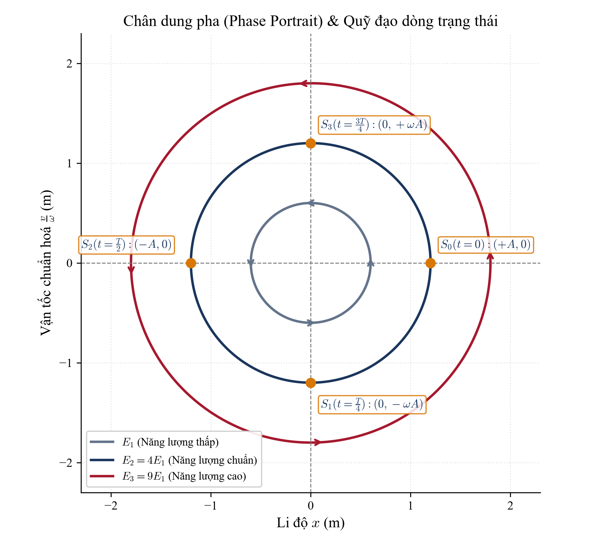
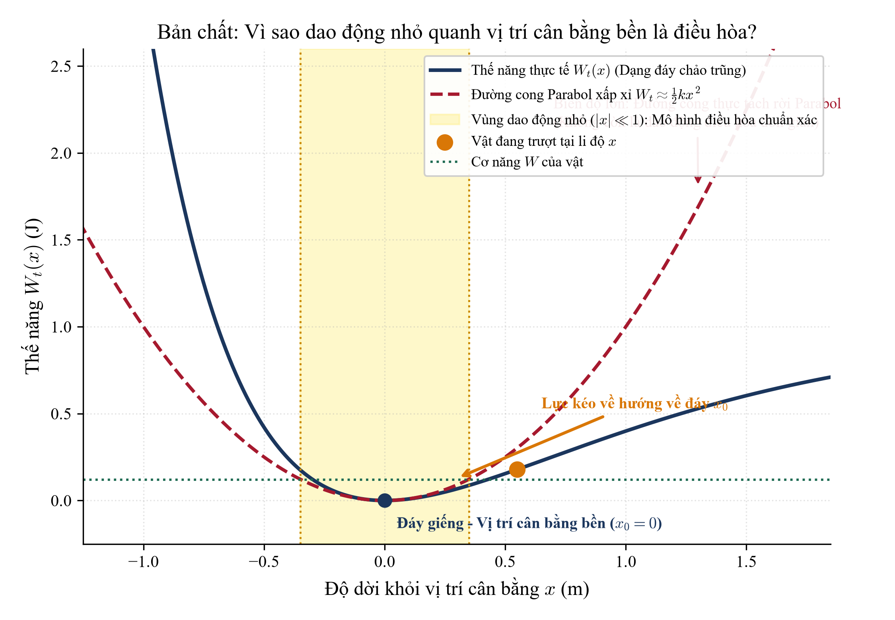
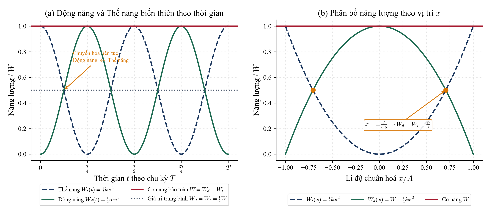
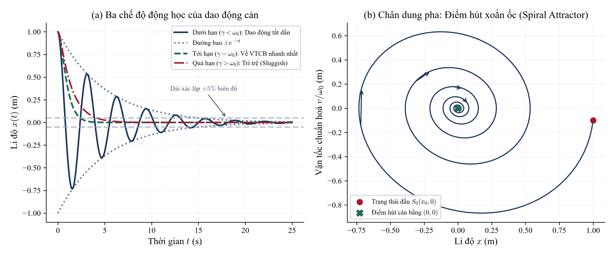
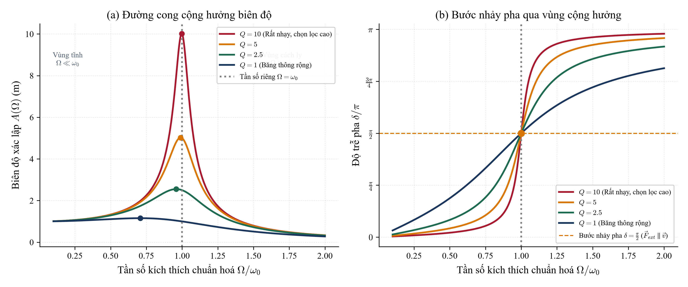

# CHƯƠNG 1: DAO ĐỘNG ĐIỀU HÒA
## BẢN CHẤT VẬT LÍ, NỀN TẢNG TOÁN HỌC & ĐỐI CHIẾU SGK "KẾT NỐI TRI THỨC VỚI CUỘC SỐNG"

---

> 📚 **ĐỐI CHIẾU CHƯƠNG TRÌNH SGK KẾT NỐI TRI THỨC VỚI CUỘC SỐNG (VẬT LÍ 11):**  
> Chương này được thiết kế như một tài liệu đồng hành chuyên sâu, soi sáng bản chất và giải mã toàn bộ các bài học trong **Chương 1: Dao động** của SGK Kết nối tri thức:  
> * **Chủ đề 1 (Bài 1, 2, 3, 4 KNTT):** Mô tả dao động điều hòa, Động học giải tích ($x, v, a$), Độ lệch pha ($\Delta \varphi$) & Đồ thị trạng thái.  
> * **Chủ đề 2 (Bài 1, 5, 7 KNTT):** Động lực học con lắc lò xo, con lắc đơn & Sự chuyển hóa năng lượng ($W_đ, W_t, W$).  
> * **Chủ đề 3 (Bài 6 KNTT):** Dao động tắt dần, Dao động duy trì, Dao động cưỡng bức & Hiện tượng cộng hưởng.

---

## 📐 HỘP CÔNG CỤ TOÁN 11 DÙNG TRONG CHƯƠNG: BẢN CHẤT ĐẠO HÀM & LƯỢNG GIÁC TRỰC QUAN

> Để không bị rơi vào lối học vẹt công thức, các em cần hiểu rõ bản chất của công cụ Toán học lớp 11 mà các nhà vật lý sử dụng để mô tả thế giới: từ tốc độ biến thiên tức thời (đạo hàm) đến ý nghĩa hình học của hàm lượng giác trên đường tròn.

### 1. Đạo hàm thực chất là gì? (Tốc độ thay đổi của một đại lượng theo thời gian)
* **Từ tốc độ trung bình đến tốc độ tức thời:**  
  Khi một vật di chuyển trên quãng đường $s$ trong khoảng thời gian $\Delta t$, đại lượng thể hiện **quãng đường thay đổi theo thời gian** là tốc độ trung bình:
  $$v_{tb} = \frac{\Delta s}{\Delta t}$$
  Nhưng nếu chiếc xe máy tăng ga vọt lên, vận tốc tại đúng thời khắc các em liếc nhìn vào đồng hồ đo tốc độ (vận tốc tức thời) là bao nhiêu?  
  Ta cho khoảng thời gian $\Delta t$ co lại cực ngắn ($\Delta t \to 0$). Khi đó, tỉ số $\frac{\Delta s}{\Delta t}$ tiến dần tới một giá trị giới hạn xác định, gọi là **Đạo hàm của quãng đường theo thời gian**:
  $$v(t) = \lim_{\Delta t \to 0} \frac{\Delta s}{\Delta t} = s'(t) = \frac{ds}{dt}$$
  *Ý nghĩa hình học (Hình 1.0a):* Vận tốc tức thời $v(t)$ chính là **độ dốc (hệ số góc $\tan\theta$) của tiếp tuyến** với đồ thị quãng đường - thời gian tại thời điểm đó! Đồ thị càng dốc đứng, vật chạy càng nhanh; đồ thị nằm ngang, vật đứng yên tức thời.

* **Gia tốc $a$ — Tốc độ thay đổi của vận tốc:**  
  Tương tự, vận tốc cũng có thể tăng nhanh hoặc giảm chậm theo thời gian. Đại lượng thể hiện **vận tốc thay đổi theo thời gian** chính là gia tốc:
  $$a(t) = \lim_{\Delta t \to 0} \frac{\Delta v}{\Delta t} = v'(t) = s''(t) = \frac{dv}{dt}$$
  Gia tốc chính là đạo hàm của vận tốc (hoặc đạo hàm cấp hai của quãng đường / li độ theo thời gian).

* **Bảng giải mã nguồn gốc các ký hiệu viết tắt quốc tế:**  
  Các ký hiệu trong sách giáo khoa không phải ngẫu nhiên, mà bắt nguồn từ các từ tiếng Anh và tiếng Latinh:
  * **$t$** = **Time** *(Thời gian)*.  
  * **$s$** = **Spatium** *(Tiếng Latinh nghĩa là khoảng cách, không gian; tiếng Anh: Space / Distance)*.  
  * **$x$** = **Coordinate** *(Tọa độ / Li độ dọc theo trục $Ox$)*.  
  * **$v$** = **Velocity** *(Vận tốc - tốc độ đổi vị trí theo thời gian)*.  
  * **$a$** = **Acceleration** *(Gia tốc - tốc độ đổi vận tốc theo thời gian)*.  
  * **$m$** = **Mass** *(Khối lượng)*.  
  * **$F$** = **Force** *(Lực)*.  
  * **$A$** = **Amplitude** *(Biên độ dao động - độ dời cực đại)*.  
  * **$\omega$** = Chữ cái Hy Lạp **Omega** *(Tần số góc - tốc độ quét góc pha)*.  
  * **$T$** = **Time Period** *(Chu kì dao động)*.  
  * **$f$** = **Frequency** *(Tần số)*.  
  * **$W$** = **Work / Energy** *(Công, năng lượng; $W_đ$: Động năng, $W_t$: Thế năng, $W$: Cơ năng)*.

### 2. Chuyến Tàu Lượn Trên Sóng Cosin: Hành Trình Khám Phá Đạo Hàm Lượng Giác & Nhân Tử $\omega$

#### Bước chuyển từ Mục 1: Đặt vấn đề tìm quy luật vận tốc
Ở **Mục 1**, chúng ta đã rút ra kết luận cốt lõi:
> **Vận tốc tức thời chính là đạo hàm của li độ theo thời gian: $v(t) = x'(t)$**, và về mặt hình học, nó chính là **độ dốc (hệ số góc của tiếp tuyến)** của đồ thị $x(t)$ tại thời điểm đó!

Bây giờ, trong dao động điều hòa, li độ biến thiên tuần hoàn theo thời gian dưới dạng hàm cosin cơ bản:
$$x(t) = \cos(t)$$
Câu hỏi tự nhiên được đặt ra: **Vận tốc $v(t) = [\cos(t)]'$ sẽ có công thức giải tích là gì?**

Chúng ta chưa hề biết trước công thức đạo hàm của hàm cosin, nhưng chúng ta đã có công cụ trực quan mạnh mẽ từ Mục 1: **Hãy đóng vai người ngồi trên toa tàu lượn siêu tốc chạy trên đường ray $x(t) = \cos(t)$ và đo độ dốc tiếp tuyến qua từng chặng đường (Hình 1.0b(a))!**

---

#### Hành trình 4 trạng thái: Lật mở dấu của đạo hàm

* **Trạng thái 1 — Đỉnh đồi cao nhất ($t = 0, x = +1$):**  
  Toa tàu vừa leo lên chóp đỉnh cao nhất. Tại đúng thời khắc này, xe tạm dừng dâng cao để chuẩn bị đổi chiều lao xuống. Đường ray tại đỉnh nằm ngang phẳng lì $\implies$ **Độ dốc bằng $0$**.  
  - Như vậy: $x'(0) = 0$ (vận tốc tức thời tại biên bằng $0$).  
  - Nhìn lại kho tàng các hàm lượng giác quen thuộc ở lớp 10, hàm số nào cũng triệt tiêu về $0$ khi $t = 0$? Đó chính là hàm $\sin(t)$, vì $\sin(0) = 0$!  
  - ⚠️ **Khoan đã, hãy dừng lại suy ngẫm:** Liệu đạo hàm là $+\sin(t)$ hay $-\sin(t)$?  
    Vì $(+\sin 0) = 0$ mà $(-\sin 0)$ cũng bằng $0$, **nên tại đỉnh đồi, chúng ta hoàn toàn CHƯA THỂ BIẾT được dấu của kết quả đạo hàm!** Dấu của đạo hàm vẫn là một ẩn số lớn đang chờ được giải mã ở chặng tiếp theo.

* **Trạng thái 2 — Rời đỉnh, đổ đèo qua Vị trí Cân bằng ($t = \frac{\pi}{2}, x = 0$) — Khoảnh khắc lật mở dấu trừ:**  
  Rời khỏi đỉnh đồi, xe bắt đầu lao dốc, độ cao giảm dần theo thời gian. Mũi xe chúi xuống dưới, tiếp tuyến nghiêng dốc xuống $\implies$ **Độ dốc tiếp tuyến chắc chắn phải mang dấu ÂM!**  
  Đặc biệt, tại đúng thời điểm $t = \frac{\pi}{2}$ khi xe quét qua vị trí cân bằng $x = 0$, đường ray dốc đứng cắm đầu với góc nghiêng $-45^\circ$, độ dốc đạt cực tiểu âm: **$-1$**.  
  Bây giờ, hãy thử đối chiếu với hai khả năng dấu:  
  - *Nếu đạo hàm là $+\sin(t)$:* Tại $t = \frac{\pi}{2}$, ta có $+\sin(\frac{\pi}{2}) = +1$ (mang dấu Dương). Điều này **mâu thuẫn hoàn toàn** với thực tế toa xe đang lao dốc cắm đầu (độ dốc âm)!  
  - *Nếu đạo hàm là $-\sin(t)$:* Tại $t = \frac{\pi}{2}$, ta có $-\sin(\frac{\pi}{2}) = -1$ (mang dấu Âm). Điều này **khớp tuyệt đối** với độ dốc $-1$ của đường ray!  
  > 🎯 **Phát hiện mang tính bước ngoặt:** Chính cú đổ đèo qua vị trí cân bằng đã vén màn bí mật: Đạo hàm của hàm cosin **bắt buộc phải có dấu trừ đằng trước**:  
  > $$[\cos(t)]' = -\sin(t)$$

* **Trạng thái 3 — Dưới đáy vực sâu nhất ($t = \pi, x = -1$):**  
  Toa tàu chạm tới đáy vực thung lũng. Tại đáy, xe ngừng hạ độ cao, chuẩn bị vòng lên. Đường ray lại nằm ngang phẳng lì $\implies$ **Độ dốc bằng $0$**.  
  - Kiểm chứng công thức vừa tìm được: $-\sin(\pi) = 0$. Hoàn toàn khớp với thực tế $v = 0$ tại biên âm!

* **Trạng thái 4 — Vọt ngược lên trời qua Vị trí Cân bằng ($t = \frac{3\pi}{2}, x = 0$):**  
  Toa tàu lấy đà phi ngược lên dốc nhất, tiếp tuyến nghiêng $+45^\circ$ hướng lên trời $\implies$ **Độ dốc đạt cực đại dương: $+1$**.  
  - Kiểm chứng công thức: $-\sin(\frac{3\pi}{2}) = -(-1) = +1$. Hoàn toàn chính xác!

---

#### Bí mật "Cỗ máy nén thời gian": Vì sao lại xuất hiện nhân tử $\omega$?

Ở Mục 1, ta đã định nghĩa $\omega$ là **tần số góc** (tốc độ biến thiên của góc pha theo thời gian). Giờ đây, xét hàm dao động tổng quát: $x(t) = \cos(\omega t)$.  
Tại sao đạo hàm của nó không chỉ đơn giản là $-\sin(\omega t)$ mà lại xuất hiện thêm nhân tử $\omega$: $-\omega \sin(\omega t)$?

Hãy quan sát **Hình 1.0b(b)**:
* Khi $\omega = 1$: Sóng uốn lượn thong thả với chu kì $T = 2\pi$. Xe đi từ đỉnh ($x = 1$) về vị trí cân bằng ($x = 0$) mất khoảng thời gian $\Delta t = \frac{\pi}{2}$, độ dốc tại VTCB là $-1$.
* Khi $\omega = 2$: Tần số dao động tăng gấp đôi, chu kì bị **nén co hẹp lại chỉ còn một nửa** ($T = \pi$). Xe đi từ đỉnh về VTCB bị rút ngắn thời gian chỉ còn $\Delta t = \frac{\pi}{4}$!
* Nhưng hãy chú ý: **Độ cao của đỉnh đồi (biên độ $A$) vẫn giữ nguyên!**
* Cùng phải vượt qua độ cao $A = 1$, nhưng thời gian di chuyển bị ép ngắn lại gấp đôi, buộc sườn đồi phải **dựng đứng gấp đôi**!
* Vì độ dốc tiếp tuyến tại mọi thời điểm bị khuếch đại lên đúng $\omega$ lần, tốc độ biến thiên tức thời (đạo hàm) tại VTCB vọt từ $-1$ lên thành $-\omega = -2$:
  $$[\cos(\omega t + \varphi)]' = -\omega \sin(\omega t + \varphi)$$
  $$[\sin(\omega t + \varphi)]' = \omega \cos(\omega t + \varphi)$$

![Hình 1.0b: Storytelling Đạo hàm lượng giác: (a) Hành trình 4 trạng thái của toa tàu lượn lật mở dấu trừ $[\cos(t)]' = -\sin(t)$; (b) Hiệu ứng nén thời gian của tần số góc $\omega$ làm sườn đồ thị dựng đứng gấp $\omega$ lần.](figures/fig1_0b_omega_derivative.png)

### 3. Ba Vệ Tinh Trên Chiếc Đồng Hồ Vũ Trụ: Giải Mã Các Cung Lượng Giác & Hệ Thức Độc Lập

#### Mối nối từ Mục 1 & Mục 2: Nghịch lý về dạng hàm của $x, v, a$
Sau khi đã làm chủ đạo hàm ở Mục 1 và Mục 2, ta thiết lập được bộ ba phương trình động học mô tả dao động điều hòa:
$$\begin{cases} 
x(t) = A\cos(\omega t + \varphi) \\ 
v(t) = x'(t) = -\omega A \sin(\omega t + \varphi) \\ 
a(t) = v'(t) = -\omega^2 A \cos(\omega t + \varphi) 
\end{cases}$$

Đến đây, học sinh thường gặp phải hai rào cản lớn trong các bài kiểm tra:
1. **Rào cản so sánh pha:** Li độ $x$ là hàm $\cos$, nhưng vận tốc $v$ lại là $-\sin$, còn gia tốc $a$ lại là $-\cos$. Làm thế nào để đưa tất cả về cùng chuẩn hàm $\cos$ nhằm biết chính xác ai sớm pha, ai trễ pha hơn ai?
2. **Rào cản khử thời gian:** Trong thực tế thí nghiệm, người ta thường đo đồng thời li độ $x$ và vận tốc $v$ tại một vị trí bất kì. Làm sao để tìm hệ thức liên hệ trực tiếp giữa $x$ và $v$ mà không cần biết thời gian $t$?

SGK Kết nối tri thức giải quyết bằng các công thức biến đổi lượng giác:
$$\cos\left(\alpha + \frac{\pi}{2}\right) = -\sin\alpha, \quad \cos(\alpha + \pi) = -\cos\alpha, \quad \cos^2\alpha + \sin^2\alpha = 1$$

Thay vì bắt trí não phải học vẹt những công thức khô khan này, các em hãy theo dõi **cuộc rượt đuổi của 3 vệ tinh trên chiếc đồng hồ vũ trụ bán kính $R = 1$ (Hình 1.0c)**:

* **Trạng thái 1 (Hình 1.0c - Trái): Vệ tinh Li độ $\vec{u}_1$ & Bản giao hưởng Pythagoras**  
  Xét một kim đồng hồ vũ trụ (véc-tơ $\vec{u}_1$) dài $R = 1$, đang chỉ góc $\alpha = \omega t + \varphi$.
  - Chiếu bóng của $\vec{u}_1$ xuống sàn nằm ngang (trục $\cos$): ta thu được **Li độ chuẩn hóa** $\cos\alpha = \frac{x}{A}$.  
  - Chiếu bóng của $\vec{u}_1$ lên vách thẳng đứng (trục $\sin$): ta thu được **Vận tốc chuẩn hóa** $\sin\alpha = -\frac{v}{\omega A}$.  
  - Hai bóng chiếu này cùng với véc-tơ $\vec{u}_1$ tạo thành một **tam giác vuông hoàn hảo** (tô màu xanh)!  
  - Áp dụng **Định lý Pythagoras** quen thuộc $(\text{cạnh kề}^2 + \text{cạnh đối}^2 = \text{cạnh huyền}^2)$:
    $$\cos^2\alpha + \sin^2\alpha = 1 \implies \left(\frac{x}{A}\right)^2 + \left(-\frac{v}{\omega A}\right)^2 = 1 \iff \left(\frac{x}{A}\right)^2 + \left(\frac{v}{\omega A}\right)^2 = 1$$
    *Bản chất sáng tỏ:* Hệ thức độc lập thời gian trong SGK thực chất chính là **Định lý Pythagoras phản chiếu lên quỹ đạo trạng thái**!

* **Trạng thái 2 (Hình 1.0c - Giữa): Vệ tinh Vận tốc $\vec{u}_2$ bứt phá chạy trước đúng một góc vuông $+90^\circ$ ($\frac{\pi}{2}$)**  
  Vận tốc là đại lượng báo trước sự thay đổi của li độ trong tương lai gần. Vì thế, vệ tinh vận tốc $\vec{u}_2$ luôn bay đón đầu trước vệ tinh li độ $\vec{u}_1$ đúng một góc vuông $+90^\circ$ ($\alpha + \frac{\pi}{2}$):  
  - Khi quay một góc vuông $+90^\circ$ ngược chiều kim đồng hồ, chiếc bóng thẳng đứng ban đầu ($\sin\alpha$) bị ngã ập xuống nằm ngang trên trục $\cos$.  
  - Nhưng vì quay sang góc phần tư thứ hai, bóng nằm ngang này rơi trúng vào nửa âm của trục hoành $\implies$ Hoành độ của $\vec{u}_2$ là $-\sin\alpha$:
    $$\cos\left(\alpha + \frac{\pi}{2}\right) = -\sin\alpha$$
  - Thay thế vào phương trình vận tốc:
    $$v(t) = -\omega A \sin(\omega t + \varphi) = \omega A \cos\left(\omega t + \varphi + \frac{\pi}{2}\right)$$
  - *Ý nghĩa vật lý trực quan:* **Vận tốc $v$ luôn sớm pha $\frac{\pi}{2}$ so với li độ $x$!** Khi li độ mới vừa tới vị trí cân bằng ($x = 0$), thì vận tốc đã sớm cán đích cực đại ($v = v_{\max}$).

* **Trạng thái 3 (Hình 1.0c - Phải): Vệ tinh Gia tốc $\vec{u}_3$ đối đầu đối diện trọn vẹn nửa vòng tròn $+180^\circ$ ($\pi$)**  
  Theo định luật II Newton, gia tốc luôn cùng hướng với lực kéo về ($F_{kv} = ma$). Khi vật lệch sang phải, lực giật mạnh sang trái để kéo vật về. Vì thế, vệ tinh gia tốc $\vec{u}_3$ luôn bay đối đầu trực diện, đi trước $\vec{u}_1$ trọn vẹn nửa vòng tròn $+180^\circ$ ($\alpha + \pi$):  
  - Phép quay $+180^\circ$ đưa véc-tơ sang vị trí đối xứng xuyên tâm qua gốc tọa độ $O$. Chiếc bóng trên trục hoành bị lật ngược chiều $180^\circ$:
    $$\cos(\alpha + \pi) = -\cos\alpha$$
  - Thay thế vào phương trình gia tốc:
    $$a(t) = -\omega^2 A \cos(\omega t + \varphi) = \omega^2 A \cos(\omega t + \varphi + \pi) = -\omega^2 x(t)$$
  - *Ý nghĩa vật lý trực quan:* **Gia tốc $a$ luôn ngược pha $\pi$ so với li độ $x$!** Khi li độ đạt cực đại dương ở biên phải ($x = +A$), gia tốc lập tức đạt giá trị cực tiểu âm ($a = -\omega^2 A$) để giằng vật trở lại.

---

# PHẦN 1: MÔ TẢ DAO ĐỘNG ĐIỀU HÒA, ĐỘNG HỌC & ĐỘ LỆCH PHA
*(Đối chiếu và giải mã chuyên sâu Bài 1, 2, 3, 4 SGK Kết nối tri thức)*

### 1. Bản Chất của Dao Động Điều Hòa: Không Phải "Quay Tròn Ngầm"

#### Quan sát thực tế & Định nghĩa SGK (Bài 1 KNTT)
* Trong đời sống, ta thường bắt gặp những chuyển động lặp đi lặp lại quanh một vị trí cân bằng xác định: chiếc xích đu đu đưa, màng loa điện thoại rung động, dây đàn guitar sau khi gảy. Những chuyển động như vậy gọi là **dao động cơ học**.
* **Định nghĩa SGK:** *Dao động điều hòa là dao động trong đó li độ của vật là một hàm cosin (hoặc sin) của thời gian*:
  $$x = A\cos(\omega t + \varphi)$$

#### Giải mã bản chất: Vì sao lại có hàm cosin?
* Trong SGK, để giúp học sinh lớp 11 làm quen với hàm cosin khi chưa học đạo hàm ở học kỳ 1, người ta thường dùng mô hình hình chiếu của một chất điểm chuyển động tròn đều lên trục toạ độ.
* **Bản chất vật lý:** Trong thực tế, quả lắc hay chiếc màng loa không hề "quay tròn ngầm". Bản chất của dao động điều hòa bắt nguồn từ việc **lực tác dụng kéo vật về vị trí cân bằng luôn tỉ lệ thuận với khoảng cách lệch**: vật lệch càng xa, lực kéo về càng mạnh.
* Quy luật lực này ép buộc gia tốc của vật luôn tỉ lệ ngược dấu với li độ:
  $$a(t) = -\omega^2 x(t)$$
  Chỉ có hàm số dạng $\sin$ và $\cos$ mới có tính chất toán học đặc biệt: *lấy đạo hàm hai lần thì quay trở lại chính hàm ban đầu đổi dấu*.

---

### 2. Các Đại Lượng Đặc Trưng (Bài 2 KNTT)

Trong phương trình $x(t) = A\cos(\omega t + \varphi)$:
* **Li độ $x$:** Độ lệch của vật khỏi vị trí cân bằng tại thời điểm $t$, có đơn vị là mét ($\text{m}$) hoặc xentimét ($\text{cm}$).
* **Biên độ $A$:** Độ lệch cực đại của vật so với vị trí cân bằng, luôn có giá trị dương ($A > 0$). Quỹ đạo chuyển động của vật là một đoạn thẳng dài $L = 2A$.
* **Chu kì $T$ (s):** Khoảng thời gian để vật thực hiện trọn vẹn một dao động toàn phần:
  $$T = \frac{2\pi}{\omega}$$
* **Tần số $f$ (Hz):** Số dao động toàn phần mà vật thực hiện được trong một giây:
  $$f = \frac{1}{T} = \frac{\omega}{2\pi}$$
* **Tần số góc $\omega$ ($\text{rad/s}$):** Tốc độ biến thiên của góc pha theo thời gian: $\omega = 2\pi f = \frac{2\pi}{T}$.
* **Pha ban đầu $\varphi$ ($\text{rad}$):** Cho biết vị trí và chiều chuyển động của vật tại thời điểm xuất phát $t = 0$.
* **Pha dao động $(\omega t + \varphi)$ ($\text{rad}$):** Cho biết trạng thái chuyển động (vị trí $x$ và chiều vận tốc $v$) của vật tại thời điểm $t$.

---

### 3. Độ Lệch Pha Giữa Hai Dao Động (Trọng tâm Bài 2 & Bài 4 KNTT)

Xét hai dao động điều hòa cùng tần số:
$$x_1 = A_1 \cos(\omega t + \varphi_1), \quad x_2 = A_2 \cos(\omega t + \varphi_2)$$

**Độ lệch pha** giữa dao động 2 và dao động 1 là:
$$\Delta \varphi = \varphi_2 - \varphi_1$$

Tùy thuộc vào giá trị của $\Delta \varphi$, ta có 3 trường hợp kinh điển xuất hiện liên tục trong các đề thi:

1. **Hai dao động cùng pha ($\Delta \varphi = 2k\pi$ với $k \in \mathbb{Z}$):**  
   * Hai vật luôn cùng tăng, cùng giảm, cùng đạt cực đại và cùng qua vị trí cân bằng theo cùng một chiều tại cùng một thời điểm.  
   * Tỉ số li độ luôn dương: $\frac{x_1}{A_1} = \frac{x_2}{A_2}$.
2. **Hai dao động ngược pha ($\Delta \varphi = (2k+1)\pi$ với $k \in \mathbb{Z}$):**  
   * Khi vật này ở biên dương thì vật kia ở biên âm; khi vật này qua VTCB theo chiều dương thì vật kia qua VTCB theo chiều âm.  
   * Tỉ số li độ luôn đối dấu: $\frac{x_1}{A_1} = -\frac{x_2}{A_2}$.
3. **Hai dao động vuông pha ($\Delta \varphi = (2k+1)\frac{\pi}{2}$ với $k \in \mathbb{Z}$):**  
   * Khi một vật ở biên thì vật kia đang đi qua vị trí cân bằng.  
   * Hai dao động thỏa mãn hệ thức độc lập dạng hình học elip:
     $$\left(\frac{x_1}{A_1}\right)^2 + \left(\frac{x_2}{A_2}\right)^2 = 1$$
   * *Ý nghĩa vật lý:* Vận tốc $v$ vuông pha với li độ $x$, và gia tốc $a$ vuông pha với vận tốc $v$!

---

### 4. Dẫn Xuất Toán Học: Vận Tốc, Gia Tốc và Mối Quan Hệ Pha (Bài 3 KNTT)

#### Bước 1: Vận tốc $v(t)$ bằng Đạo hàm Li độ
Vận tốc tức thời là đạo hàm của li độ theo thời gian:
$$v(t) = x'(t) = \left[A\cos(\omega t + \varphi)\right]' = -\omega A \sin(\omega t + \varphi)$$

Dùng công thức lượng giác $-\sin\alpha = \cos(\alpha + \pi/2)$:
$$v(t) = \omega A \cos\left(\omega t + \varphi + \frac{\pi}{2}\right)$$

* **Vận tốc cực đại:** $v_{\max} = \omega A$ (khi vật đi qua vị trí cân bằng $x = 0$ theo chiều dương).
* **Độ lệch pha:** Vận tốc $v$ **sớm pha $\frac{\pi}{2}$** so với li độ $x$.

#### Bước 2: Gia tốc $a(t)$ bằng Đạo hàm Vận tốc
Gia tốc tức thời là đạo hàm của vận tốc theo thời gian:
$$a(t) = v'(t) = x''(t) = \left[-\omega A \sin(\omega t + \varphi)\right]' = -\omega^2 A \cos(\omega t + \varphi)$$

Dùng công thức lượng giác $-\cos\alpha = \cos(\alpha + \pi)$:
$$a(t) = \omega^2 A \cos\left(\omega t + \varphi + \pi\right)$$

* **Gia tốc cực đại:** $a_{\max} = \omega^2 A$ (khi vật ở biên âm $x = -A$).
* **Mối liên hệ gia tốc và li độ:** Vì $x = A\cos(\omega t + \varphi)$ nên:
  $$a(t) = -\omega^2 x(t)$$
* **Độ lệch pha:** Gia tốc $a$ **ngược pha hoàn toàn ($\pi$)** so với li độ $x$, và **sớm pha $\frac{\pi}{2}$** so với vận tốc $v$.

---

> 🔍 **DẪN DẮT MẮT ĐỌC (Hình 1.1):**  
> * **Hãy quan sát sự lệch pha giữa các đồ thị:**  
>   - Đồ thị li độ (màu xanh navy) đạt đỉnh tại $t = 0$.  
>   - Nhưng đồ thị vận tốc (màu xanh lá) đã đạt giá trị $0$ tại $t = 0$, và đạt đỉnh âm tại $t = T/4$.  
>   - Đồ thị gia tốc (màu đỏ thẫm) hoàn toàn uốn lượn ngược chiều so với đồ thị li độ: hễ $x$ dương thì $a$ âm, $x$ cực đại thì $a$ cực tiểu!

---

### 5. Hệ Thức Độc Lập Thời Gian & Đồ Thị Trạng Thái $(x, v/\omega)$

Từ hai phương trình:
$$\frac{x}{A} = \cos(\omega t + \varphi), \quad \frac{v}{\omega A} = -\sin(\omega t + \varphi)$$

Bình phương hai vế rồi cộng lại:
$$\left(\frac{x}{A}\right)^2 + \left(\frac{v}{\omega A}\right)^2 = \cos^2(\omega t + \varphi) + \sin^2(\omega t + \varphi) = 1$$
Hay viết gọn lại:
$$x^2 + \frac{v^2}{\omega^2} = A^2 \iff a = -\omega^2 x \implies \left(\frac{a}{\omega^2 A}\right)^2 + \left(\frac{v}{\omega A}\right)^2 = 1$$

Đây là **hệ thức độc lập thời gian** cốt lõi giúp các em giải quyết hầu hết các bài toán tính nhanh khi không biết thời gian $t$.

> 🔍 **DẪN DẮT MẮT ĐỌC (Hình 1.2):**  
> Nếu đặt trục hoành là li độ $x$ và trục tung là vận tốc chuẩn hóa $y = \frac{v}{\omega}$, hệ thức độc lập biến thành phương trình đường tròn $x^2 + y^2 = A^2$.  
> Khi vật dao động, điểm trạng thái chạy trên đường tròn **thuận chiều kim đồng hồ**:  
> * $S_0(t = 0)$: Vật ở biên dương $(+A, 0)$, vận tốc bằng $0$.  
> * $S_1(t = T/4)$: Vật qua VTCB theo chiều âm $(0, -\omega A)$, vận tốc âm cực đại.  
> * $S_2(t = T/2)$: Vật tới biên âm $(-A, 0)$, vận tốc bằng $0$.  
> * $S_3(t = 3T/4)$: Vật qua VTCB theo chiều dương $(0, +\omega A)$, vận tốc dương cực đại.

---

### 6. Bài Toán Tính Số Thực Tế 1.1 (Theo Dạng Bài 4 KNTT)

> **Bài toán:** Một màng loa tai nghe điện thoại dao động điều hòa phát ra âm La ($440\text{ Hz}$) với biên độ rung $A = 0.5\text{ mm} = 0.5 \times 10^{-3}\text{ m}$.  
> 1. Tính tần số góc $\omega$ và chu kì dao động $T$ của màng loa.  
> 2. Tính tốc độ cực đại $v_{\max}$ và gia tốc cực đại $a_{\max}$ của màng loa.  
> 3. Khi màng loa đang ở vị trí $x = 0.3\text{ mm}$, hãy tính tốc độ tức thời của màng loa.
> 
> **Lời giải chi tiết:**  
> 1. **Tần số góc và chu kì:**  
>    * $\omega = 2\pi f = 2\pi \times 440 \approx 2764.6\text{ rad/s}$.  
>    * $T = \frac{1}{f} = \frac{1}{440} \approx 0.00227\text{ s} = 2.27\text{ ms}$.  
> 2. **Tốc độ cực đại và gia tốc cực đại:**  
>    * $v_{\max} = \omega A = 2764.6 \times (0.5 \times 10^{-3}) \approx 1.38\text{ m/s}$.  
>    * $a_{\max} = \omega^2 A = (2764.6)^2 \times (0.5 \times 10^{-3}) \approx 3821.5\text{ m/s}^2 \approx 390\text{ g}$.  
> 3. **Tốc độ tức thời khi $x = 0.3\text{ mm}$:**  
>    Áp dụng hệ thức độc lập thời gian:  
>    $$x^2 + \frac{v^2}{\omega^2} = A^2 \implies |v| = \omega \sqrt{A^2 - x^2}$$  
>    Thay số trực tiếp:  
>    $$|v| = 2764.6 \times \sqrt{0.5^2 - 0.3^2} = 2764.6 \times 0.4 = 1105.8\text{ mm/s} \approx 1.11\text{ m/s}$$

---

> ⚠️ **CẢNH BÁO BẪY ĐỀ THI:**  
> * **Bẫy 1:** Nhầm lẫn *"ở biên vận tốc bằng 0 thì gia tốc cũng bằng 0"*.  
>   $\rightarrow$ **Thực tế:** Ở biên, lò xo bị nén/dãn mạnh nhất nên lực hồi phục lớn nhất, gia tốc đạt **cực đại** ($a = \pm \omega^2 A$).  
> * **Bẫy 2:** Nhầm lẫn *"qua VTCB gia tốc bằng 0 thì vận tốc cũng bằng 0"*.  
>   $\rightarrow$ **Thực tế:** Qua VTCB, lực triệt tiêu nên $a = 0$, nhưng vận tốc lại đạt **cực đại** ($|v| = v_{\max} = \omega A$).

---

# PHẦN 2: ĐỘNG LỰC HỌC & SỰ CHUYỂN HÓA NĂNG LƯỢNG
*(Đối chiếu và giải mã chuyên sâu Bài 1, 5, 7 SGK Kết nối tri thức)*

### 1. Động Lực Học Con Lắc Lò Xo & Con Lắc Đơn

#### Con lắc lò xo
Xét quả cầu nhỏ khối lượng $m$ gắn vào lò xo có độ cứng $k$ trượt không ma sát.  
* **Lực kéo về:** $F_{kv} = -kx$.  
* **Định luật II Newton:** $F = ma \iff -kx = ma \implies a = -\frac{k}{m}x$.  
* So sánh với $a = -\omega^2 x$, ta thu được công thức tần số góc và chu kì của con lắc lò xo:
  $$\omega = \sqrt{\frac{k}{m}}, \quad T = 2\pi\sqrt{\frac{m}{k}}$$

#### Con lắc đơn
Xét sợi dây chiều dài $\ell$ treo vật nặng $m$. Khi góc lệch $\alpha$ nhỏ ($\alpha \le 10^\circ \approx 0.175\text{ rad}$), $\sin\alpha \approx \alpha = \frac{s}{\ell}$.  
* **Lực kéo về:** $F_t = -mg\sin\alpha \approx -\left(\frac{mg}{\ell}\right)s$.  
* Chu kì dao động điều hòa của con lắc đơn:
  $$T = 2\pi\sqrt{\frac{\ell}{g}}$$

---

### 2. Ẩn Dụ Đáy Chảo Parabol: Nguồn Gốc Sâu Xa của Dao Động Điều Hòa

Tại sao từ cành cây, dây đàn đến cầu treo hay nguyên tử đều dao động điều hòa?

* **Hình ảnh chiếc chảo:** Hãy hình dung một **hòn bi nằm dưới đáy một chiếc chảo trũng**.  
  1. Điểm sâu nhất của đáy chảo ($x_0 = 0$) là **Vị trí cân bằng bền**, nơi thế năng của vật đạt giá trị cực tiểu.  
  2. Gần đáy chảo, bất kỳ đường cong trơn nào cũng có thể áp vừa khít một đường cong **Parabol** bậc hai:
     $$W_t(x) \approx \frac{1}{2}kx^2$$
  3. Khi hòn bi lệch khỏi đáy một đoạn nhỏ $x$, phản lực dốc của thành chảo sẽ đẩy hòn bi trở về với lực tỉ lệ với độ dời: $F = -kx$.

> 🔍 **DẪN DẮT MẮT ĐỌC (Hình 1.3):**  
> Trong vùng màu vàng nhạt ($|x| \le 0.35$), đường cong thế năng thực tế màu xanh và parabol màu đỏ **hoàn toàn trùng khít lên nhau**. Điều này giải thích chân lý: *Mọi dao động nhỏ quanh vị trí cân bằng bền trong vũ trụ đều là dao động điều hòa!*

---

### 3. Động Năng, Thế Năng & Cơ Năng (Bài 5 & 7 KNTT)

Theo chuẩn ký hiệu của SGK Kết nối tri thức:

1. **Động năng $W_đ$:**
   $$W_đ = \frac{1}{2}mv^2 = \frac{1}{2}m\omega^2 A^2 \sin^2(\omega t + \varphi) = \frac{1}{2}kA^2 \sin^2(\omega t + \varphi)$$
2. **Thế năng $W_t$:**
   $$W_t = \frac{1}{2}kx^2 = \frac{1}{2}kA^2 \cos^2(\omega t + \varphi)$$
3. **Cơ năng toàn phần $W$:**
   $$W = W_đ + W_t = \frac{1}{2}kA^2 \left[\sin^2(\omega t + \varphi) + \cos^2(\omega t + \varphi)\right] = \frac{1}{2}kA^2 = \frac{1}{2}m v_{\max}^2 = \text{const}$$

> 💡 **Quy luật bảo toàn (Bài 5 KNTT):** Khi bỏ qua ma sát, cơ năng của vật dao động điều hòa được bảo toàn tuyệt đối, tỉ lệ thuận với bình phương biên độ dao động ($W \propto A^2$).

#### Chu kì biến thiên của Động năng và Thế năng
Dùng công thức hạ bậc lượng giác:
$$\sin^2\alpha = \frac{1 - \cos 2\alpha}{2}, \quad \cos^2\alpha = \frac{1 + \cos 2\alpha}{2}$$
* Động năng và thế năng biến thiên tuần hoàn với **tần số góc gấp đôi ($2\omega$)**, **chu kì bằng một nửa ($T' = T/2$)** và **tần số gấp đôi ($f' = 2f$)** so với dao động điều hòa của li độ $x$.

> 🔍 **DẪN DẮT MẮT ĐỌC (Hình 1.4):**  
> * **Đồ thị (a):** Đường màu xanh lá ($W_đ$) và đường màu xanh navy ($W_t$) liên tục đổi chỗ cho nhau nhưng tổng của chúng luôn nằm trên đường thẳng đỏ $W$. Đường chấm xám ở giữa thể hiện giá trị trung bình theo thời gian: $\bar{W}_đ = \bar{W}_t = \frac{1}{2}W$.  
> * **Đồ thị (b):** Vị trí hai parabol cắt nhau ứng với điểm **Động năng bằng Thế năng**:  
>   $$W_đ = W_t \implies W_t = \frac{W}{2} \iff \frac{1}{2}kx^2 = \frac{1}{2}\left(\frac{1}{2}kA^2\right) \implies x = \pm \frac{A}{\sqrt{2}}$$

---

### 4. Bài Toán Tính Số Thực Tế 1.2 (Theo Dạng Bài 7 KNTT)

> **Bài toán:** Một con lắc lò xo gồm vật nặng $m = 200\text{ g} = 0.2\text{ kg}$ gắn vào lò xo có độ cứng $k = 50\text{ N/m}$ dao động điều hòa với biên độ $A = 6\text{ cm} = 0.06\text{ m}$.  
> 1. Tính cơ năng $W$ của con lắc.  
> 2. Tính vận tốc cực đại $v_{\max}$ của vật.  
> 3. Tìm li độ $x$ của vật khi động năng gấp 3 lần thế năng ($W_đ = 3W_t$).  
> 
> **Lời giải chi tiết:**  
> 1. **Cơ năng của con lắc:**  
>    $$W = \frac{1}{2}kA^2 = \frac{1}{2} \times 50 \times (0.06)^2 = 0.09\text{ J} = 90\text{ mJ}$$  
> 2. **Vận tốc cực đại:**  
>    $$W = \frac{1}{2}m v_{\max}^2 \implies v_{\max} = \sqrt{\frac{2W}{m}} = \sqrt{\frac{2 \times 0.09}{0.2}} = \sqrt{0.9} \approx 0.949\text{ m/s} = 94.9\text{ cm/s}$$  
> 3. **Vị trí có $W_đ = 3W_t$:**  
>    Áp dụng bảo toàn cơ năng:  
>    $$W = W_đ + W_t = 3W_t + W_t = 4W_t$$  
>    $$\frac{1}{2}kA^2 = 4\left(\frac{1}{2}kx^2\right) \implies x^2 = \frac{A^2}{4} \implies x = \pm \frac{A}{2} = \pm \frac{6}{2} = \pm 3\text{ cm}$$

---

# PHẦN 3: DAO ĐỘNG TẮT DẦN, CƯỠNG BỨC & CỘNG HƯỞNG
*(Đối chiếu và giải mã chuyên sâu Bài 6 SGK Kết nối tri thức)*

### 1. Dao Động Tắt Dần & Sự Tiêu Tán Cơ Năng

* **Định nghĩa SGK (Bài 6 KNTT):** *Dao động tắt dần là dao động có biên độ và cơ năng giảm dần theo thời gian*.
* **Cơ chế vi mô:** Do có lực ma sát hoặc lực cản môi trường, cơ năng của hệ liên tục sinh công âm và biến thành nhiệt năng ($Q_{nhiệt}$) tỏa ra môi trường. Vì cơ năng $W = \frac{1}{2}kA^2$ giảm liên tục, biên độ $A$ bắt buộc phải thu hẹp dần cho đến khi dừng hẳn.

#### Ba Chế Độ Cản Trong Đời Sống Thực Tế
1. **Lực cản nhỏ (Dao động tắt dần):** Vật vẫn dao động qua lại quanh VTCB nhiều lần trước khi dừng hẳn (như con lắc đung đưa trong không khí).
2. **Lực cản tới hạn:** Vật trở về VTCB **nhanh nhất** mà không hề bị vọt lố hay lắc qua lắc lại.  
   * **Ứng dụng đắt giá:** **Bộ giảm xóc (phuộc nhún) xe máy và ô tô**. Khi bánh xe đập vào ổ gà, lò xo bị nén; dầu giảm chấn trong xi-lanh dập tắt dao động ngay lập tức trong nhịp đầu tiên, giúp xe giữ thăng bằng và êm ái.
3. **Lực cản quá lớn:** Vật chuyển động rất ì ạch, chậm chạp trở về VTCB.  
   * **Ứng dụng:** **Tay co thủy lực đóng cửa tự động**, giữ cửa khép từ từ, tránh va đập mạnh làm vỡ kính.

---

### 2. Dao Động Duy Trì (Con Lắc Đồng Hồ)

* Để một hệ dao động mãi với tần số riêng $\omega_0$ mà không bị tắt dần, ta phải cung cấp năng lượng cho hệ trong mỗi chu kì để bù đắp đúng bằng phần năng lượng tiêu hao do ma sát.
* **Đặc điểm:** Tần số dao động duy trì vẫn bằng đúng tần số dao động riêng $\omega_0$ của hệ.
* **Ví dụ:** Đồng hồ quả lắc dùng quả tạ hoặc dây cót truyền lực đẩy khẽ vào con lắc qua cơ cấu bánh cóc (ngựa đồng hồ) mỗi khi con lắc đi qua vị trí cân bằng.

---

### 3. Dao Động Cưỡng Bức & Hiện Tượng Cộng Hưởng

Nếu ta tác dụng vào hệ một ngoại lực tuần hoàn $F(t) = F_0 \cos(\Omega t)$:

1. **Đặc điểm của Dao động Cưỡng bức:**
   * Hệ sẽ dao động với **tần số bằng tần số $\Omega$ của ngoại lực**, không còn giữ tần số riêng $\omega_0$.
   * Biên độ dao động cưỡng bức phụ thuộc vào biên độ ngoại lực $F_0$, lực cản môi trường và đặc biệt là **khoảng cách giữa tần số ngoại lực $\Omega$ và tần số riêng $\omega_0$**.

2. **Hiện Tượng Cộng Hưởng (Resonance):**
   * Khi tần số ngoại lực xấp xỉ bằng tần số dao động riêng của hệ:
     $$\Omega \approx \omega_0$$
     Biên độ của dao động cưỡng bức vọt lên đạt giá trị **cực đại**. Hiện tượng này gọi là **hiện tượng cộng hưởng**.

> 🔍 **DẪN DẮT MẮT ĐỌC (Hình 1.6):**  
> * Trục đứng tại vị trí $\Omega/\omega_0 = 1.0$ là vị trí cộng hưởng.  
> * Đường màu đỏ (lực cản nhỏ) có đỉnh cộng hưởng nhọn hoắt và biên độ vọt lên rất cao.  
> * Đường màu xanh navy (lực cản lớn) có đỉnh thoai thoải, biên độ không tăng vọt nguy hiểm.

#### Ứng Dụng & Tác Hại của Cộng Hưởng
* **Ứng dụng có lợi:**
  - Hộp cộng hưởng của đàn guitar, violin, đàn bầu giúp khuếch đại âm thanh phát ra to và vang.
  - Chỉnh núm xoay mạch thu sóng radio để tần số riêng của máy trùng với tần số của đài phát cần nghe.
* **Tác hại cần tránh:**
  - Binh lính bước đều qua cầu làm tần số bước chân trùng tần số dao động của cầu gây sập cầu (lệnh quân sự bắt buộc: *bước tự do khi qua cầu*).
  - Gió bão thổi tạo luồng khí xoáy trùng tần số rung làm sập cầu Tacoma Narrows năm 1940.
  - Máy giặt khi vắt ở tốc độ cao nếu tần số quay của lồng giặt trùng với tần số riêng của vỏ máy sẽ làm máy rung lắc dữ dội và kêu ầm ĩ.

---

### 4. Bài Toán Tính Số Thực Tế 1.3 (Bài Toán Gờ Giảm Tốc KNTT)

> **Bài toán:** Một chiếc xe máy chở người có tổng khối lượng $m = 160\text{ kg}$. Hệ thống giảm xóc có độ cứng tương đương $k = 40,000\text{ N/m}$. Xe chạy trên một đoạn đường có các gờ giảm tốc cách đều nhau một khoảng $d = 8.0\text{ m}$.  
> 1. Tính tần số dao động riêng $f_0$ của khung xe máy.  
> 2. Người lái xe chạy với tốc độ $v$ bằng bao nhiêu thì xe bị rung lắc nảy lên dữ dội nhất?
> 
> **Lời giải chi tiết:**  
> 1. **Tần số dao động riêng của xe:**  
>    * Tần số góc riêng:  
>      $$\omega_0 = \sqrt{\frac{k}{m}} = \sqrt{\frac{40000}{160}} = \sqrt{250} \approx 15.81\text{ rad/s}$$  
>    * Tần số riêng:  
>      $$f_0 = \frac{\omega_0}{2\pi} = \frac{15.81}{2\pi} \approx 2.52\text{ Hz}$$  
> 2. **Tốc độ gây rung nảy mạnh nhất (Cộng hưởng):**  
>    * Thời gian xe chạy qua hai gờ liên tiếp là chu kì kích thích của ngoại lực: $T = \frac{d}{v}$.  
>    * Tần số kích thích của các gờ giảm tốc: $f = \frac{1}{T} = \frac{v}{d}$.  
>    * Xe rung lắc mạnh nhất khi xảy ra hiện tượng cộng hưởng: $f = f_0$.  
>      $$\frac{v}{d} = f_0 \implies v = d \cdot f_0 = 8.0\text{ m} \times 2.52\text{ Hz} = 20.16\text{ m/s}$$  
>    * Đổi sang $\text{km/h}$:  
>      $$v = 20.16 \times 3.6 \approx 72.6\text{ km/h}$$  
>    * *Bài học thực tế:* Người lái xe cần tránh chạy ở dải tốc độ nguy hiểm khoảng $70 - 75\text{ km/h}$ khi đi qua đoạn đường này; nên giảm tốc độ xuống dưới $30\text{ km/h}$ để bảo đảm an toàn.

---

## BẢNG TỔNG KẾT BẢN CHẤT CHƯƠNG 1 (THEO CHUẨN KNTT)

| Đại lượng / Hiện tượng | Công thức cốt lõi | Ý nghĩa bản chất & Lưu ý kiểm tra |
| :--- | :--- | :--- |
| **Li độ** | $x = A\cos(\omega t + \varphi)$ | Tọa độ của vật so với VTCB tại thời điểm $t$. |
| **Vận tốc** | $v = x'(t) = \omega A\cos(\omega t + \varphi + \pi/2)$ | Vận tốc sớm pha $\pi/2$ so với li độ; $v_{\max} = \omega A$ tại VTCB. |
| **Gia tốc** | $a = v'(t) = -\omega^2 x$ | Gia tốc ngược pha $\pi$ so với li độ; luôn hướng về VTCB; $a_{\max} = \omega^2 A$ ở biên. |
| **Hệ thức độc lập** | $x^2 + \frac{v^2}{\omega^2} = A^2$ | Tính nhanh không qua thời gian $t$; liên hệ giữa vị trí và vận tốc. |
| **Độ lệch pha** | $\Delta \varphi = \varphi_2 - \varphi_1$ | Cùng pha ($2k\pi$), ngược pha ($(2k+1)\pi$), vuông pha ($(2k+1)\pi/2$). |
| **Động năng** | $W_đ = \frac{1}{2}mv^2$ | Biến thiên tuần hoàn với tần số góc $2\omega$, chu kì $T/2$. |
| **Thế năng** | $W_t = \frac{1}{2}kx^2 = \frac{1}{2}m\omega^2 x^2$ | Đạt cực đại ở biên; bằng 0 ở vị trí cân bằng. |
| **Cơ năng** | $W = W_đ + W_t = \frac{1}{2}kA^2 = \text{const}$ | Bảo toàn tuyệt đối khi không ma sát; tỉ lệ thuận với $A^2$. |
| **Vị trí $W_đ = W_t$** | $x = \pm \frac{A}{\sqrt{2}}$ | Vị trí động năng bằng một nửa cơ năng ($W_đ = W/2$). |
| **Cộng hưởng** | $\Omega \approx \omega_0$ | Biên độ dao động cưỡng bức vọt lên cực đại. |
